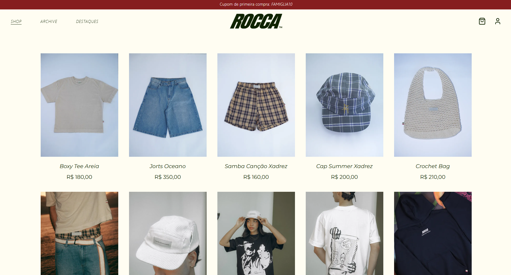
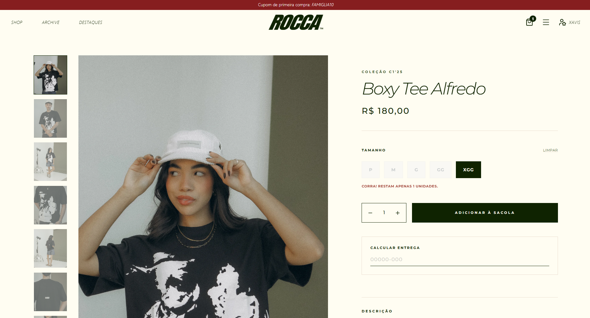
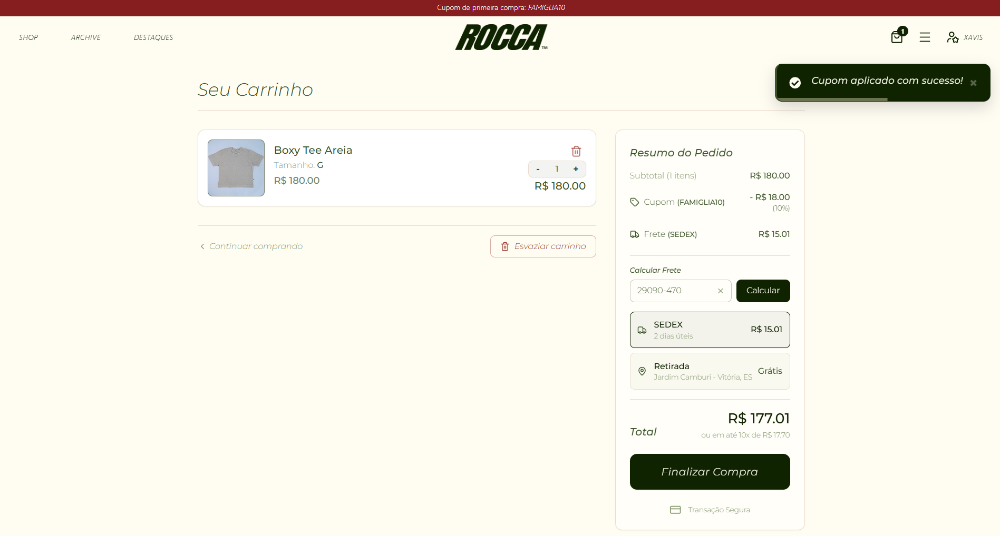
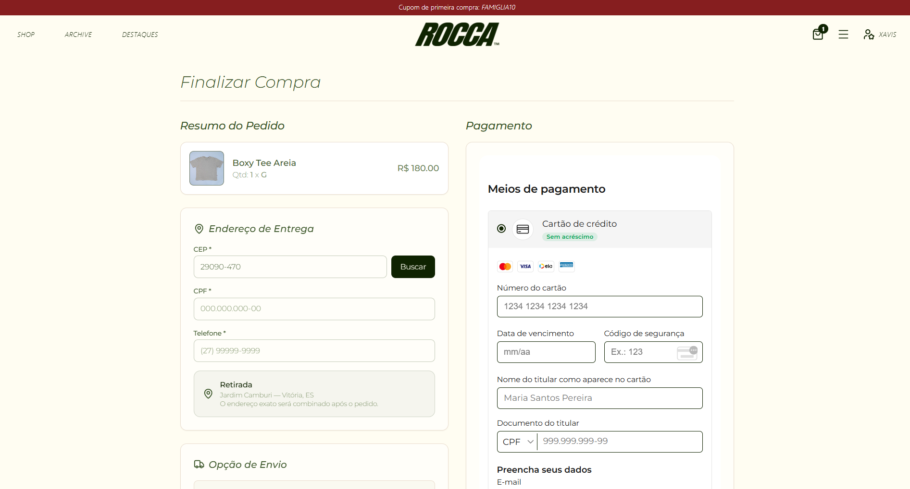
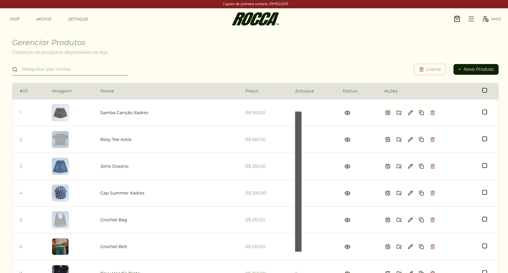
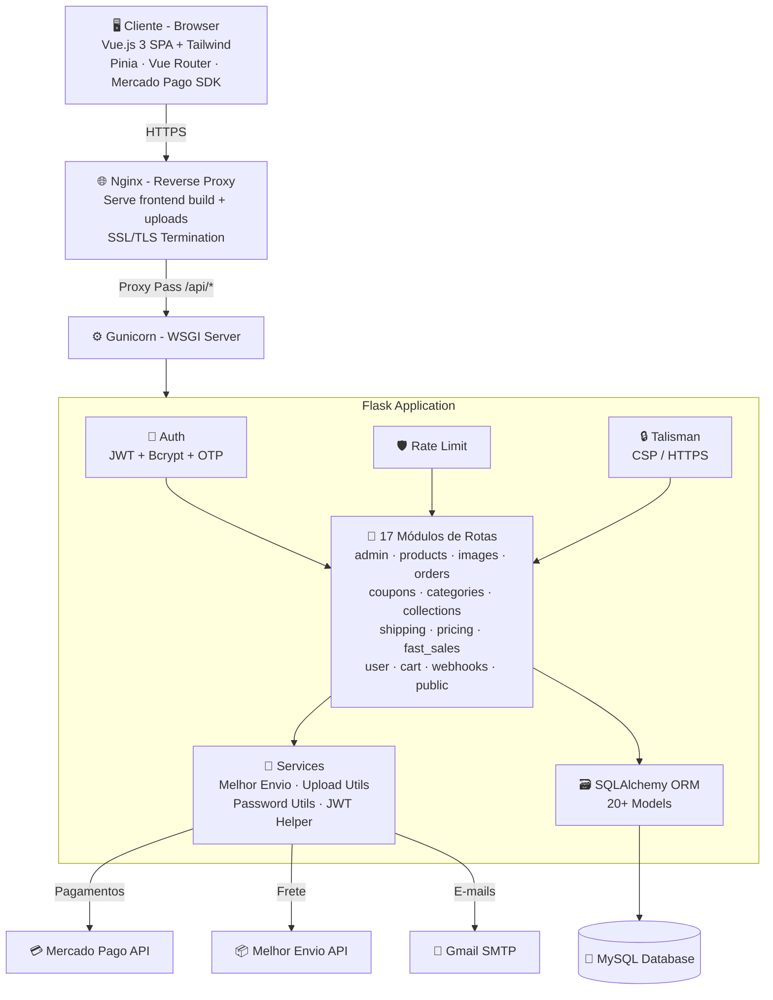

<p align="center">
  <h1 align="center">🛒 Fullstack E-Commerce Platform</h1>
  <p align="center">
    Plataforma e-commerce fullstack completa, desenvolvida do zero — da loja pública ao painel administrativo.
    <br/>
    <strong>Vue.js · Flask · MySQL · Tailwind CSS · Mercado Pago · Melhor Envio · Nginx · VPS</strong>
  </p>
</p>

<p align="center">
  
  
  
  
  
  
  
  
</p>

---

> **⚠️ Repositório Showcase** — Esta é uma versão sanitizada de um sistema em **produção real**. Credenciais, variáveis de ambiente e configurações sensíveis foram removidas por segurança. O código está disponível **apenas para visualização e análise**.

---

## 📋 Sobre o Projeto

Plataforma e-commerce completa desenvolvida para uma marca de moda, abrangendo toda a jornada — desde a **loja pública** com catálogo, carrinho e checkout, até o **painel administrativo** com gestão de produtos, pedidos, cupons, precificação e vendas rápidas.

Sistema **fullstack** pronto para produção com integração de **pagamentos** (Mercado Pago), **cálculo de frete** (Melhor Envio / Correios) e **otimização de imagens** (WebP + thumbnails + placeholders blur).

**🌐 Projeto em produção:** [roccainternazionale.com](https://roccainternazionale.com)

### 📸 Preview

Dados reais ocultados por questões de segurança.

<table>
  <tr>
    <td align="center"><br/><sub>Loja / Vitrine</sub></td>
    <td align="center"><br/><sub>Detalhe do Produto</sub></td>
    <td align="center"><br/><sub>Carrinho</sub></td>
  </tr>
  <tr>
    <td align="center"><br/><sub>Checkout</sub></td>
    <td align="center"><br/><sub>Catálogo de Produtos</sub></td>
    <td align="center"><br/><sub>Archive & Sidebar</sub></td>
  </tr>
</table>

---

## ✨ Funcionalidades

### 🛍️ Loja Pública

#### 🏠 Vitrine / Home
- Catálogo de produtos com grid responsivo
- Filtros por **categorias** e **coleções**
- Ordenação e paginação
- Imagens otimizadas com **lazy loading** + **placeholder blur** (base64)
- Agendamento de publicação de produtos

#### 📦 Detalhe do Produto
- Galeria de imagens com seleção de variantes (tamanhos)
- Controle de estoque por variante (P, M, G, GG, Único)
- Preço dinâmico e verificação de disponibilidade em tempo real

#### 🛒 Carrinho de Compras
- Persistência no backend (vinculado ao usuário logado)
- Controle de quantidade com validação de estoque
- Aplicação de cupons de desconto
- Dropdown de preview no navbar

#### 💳 Checkout Completo
- Formulário de endereço com busca de CEP automática
- Cálculo de frete integrado com **Melhor Envio** (PAC / SEDEX)
- Pagamento via **Mercado Pago** (Pix e Cartão de Crédito)
- Parcelamento configurável
- Webhooks de confirmação de pagamento
- Telas de sucesso e de aguardando Pix

#### 🔐 Autenticação de Clientes
- Cadastro com **verificação de e-mail** (OTP de 6 dígitos)
- Login com **JWT** (JSON Web Tokens)
- Troca de e-mail e senha com validação OTP
- Recuperação de senha via e-mail
- Área do cliente: perfil e histórico de pedidos

### 🔧 Painel Administrativo

#### 📦 Gestão de Produtos
- CRUD completo com variantes de tamanho e estoque por variante
- Upload de múltiplas imagens com **drag & drop** e reordenação
- Otimização automática: conversão WebP, thumbnail (600px), placeholder blur (20px)
- Agendamento de publicação (publish scheduling)
- Lixeira de produtos (soft delete com restauração)
- Ordenação customizada dos produtos na loja (sort_order)

#### 🏷️ Categorias & Coleções
- CRUD de categorias e coleções
- Associação N:N com produtos
- Ordenação de destaque por categoria (highlight_order)

#### 🎟️ Sistema de Cupons
- Cupons de desconto: percentual ou valor fixo
- Frete grátis como benefício de cupom
- Regras avançadas: gasto mínimo/máximo, uso individual, data de validade
- Filtros por produtos, categorias e coleções (inclusão e exclusão)
- Limites de uso total e por conta
- Ativação/desativação de cupons

#### 📋 Gestão de Pedidos
- Listagem de pedidos com filtros de status
- Detalhes completos: itens, endereço, frete, pagamento
- Integração com **Melhor Envio** para adicionar ao carrinho de despacho

#### 💰 Vendas Rápidas (Presenciais)
- Registro de vendas presenciais (balcão/evento)
- Seleção de produtos e variantes com controle de estoque
- Métodos: Pix, Dinheiro, Cartão, Cota
- CRUD completo (criar, editar, visualizar, deletar)

#### 💲 Precificação
- Calculadora de precificação por produto
- Custo, preço, subsídio de frete, ads

#### 👥 Gestão de Usuários/Clientes
- Listagem de clientes com promoção a admin
- Controle de permissões (cliente vs. admin)

#### 📊 Políticas e Páginas Legais
- Política de Privacidade e Política de Devolução renderizadas no frontend

---

## 🛠️ Stack Tecnológica

### Frontend
| Tecnologia | Uso |
|---|---|
| **Vue.js 3** | Framework SPA com Composition API |
| **Vite 6** | Build tool e dev server |
| **Tailwind CSS 3** | Estilização utilitária |
| **Pinia** | Gerenciamento de estado global (carrinho, auth, UI) |
| **Vue Router 4** | Roteamento SPA com guards de autenticação |
| **Axios** | HTTP client para API REST |
| **Mercado Pago SDK** | Integração de pagamentos (Pix + Cartão) |
| **Lucide Icons** | Biblioteca de ícones |
| **Vue Toastification** | Notificações toast |
| **Reka UI** | Componentes UI headless |
| **shadcn-vue** | Sistema de componentes estilizados |
| **VueUse** | Composition utilities |

### Backend
| Tecnologia | Uso |
|---|---|
| **Python / Flask 3.1** | Framework web e API REST |
| **Flask-SQLAlchemy** | ORM para modelagem e consultas ao banco de dados |
| **Flask-JWT-Extended** | Autenticação baseada em tokens JWT |
| **Flask-Bcrypt** | Hash seguro de senhas |
| **Flask-Limiter** | Rate limiting por IP |
| **Flask-Talisman** | Security headers e CSP (Content Security Policy) |
| **Flask-CORS** | Controle de CORS dinâmico (dev/prod) |
| **Flask-Mail** | Envio de e-mails transacionais (OTP, confirmações) |
| **Pillow (PIL)** | Processamento de imagens: resize, WebP, thumbnails, placeholders |
| **PyMySQL** | Driver de conexão com MySQL |
| **APScheduler** | Agendamento de tarefas (publicação programada de produtos) |
| **Requests** | Comunicação com APIs externas (Melhor Envio, VPS) |

### Integrações Externas
| Serviço | Uso |
|---|---|
| **Mercado Pago** | Gateway de pagamento (Pix + Cartão de Crédito) |
| **Melhor Envio** | Cálculo de frete (PAC / SEDEX) e geração de etiquetas |
| **Gmail SMTP** | Envio de e-mails transacionais (verificação, senha) |

### Infraestrutura
| Tecnologia | Uso |
|---|---|
| **Linux (Ubuntu VPS)** | Servidor de produção |
| **Nginx** | Reverse proxy, SSL/TLS e arquivos estáticos |
| **Gunicorn** | WSGI HTTP Server para Flask |
| **MySQL** | Banco de dados relacional |

---

## 🏗️ Arquitetura



---

## 📂 Estrutura do Projeto

```
fullstack-ecommerce-platform-Showcase/
│
├── backend/
│   ├── rocca_app/
│   │   ├── __init__.py              # App factory (Flask, extensões, CORS, Talisman, Mail)
│   │   ├── models.py                # 20+ modelos SQLAlchemy
│   │   ├── routes/
│   │   │   ├── admin_product_routes.py    # CRUD de produtos (variantes, imagens, agendamento)
│   │   │   ├── admin_images_routes.py     # Upload, otimização e gestão de imagens
│   │   │   ├── admin_order_routes.py      # Gestão de pedidos administrativos
│   │   │   ├── admin_coupon_routes.py     # CRUD de cupons com regras avançadas
│   │   │   ├── admin_category_routes.py   # CRUD de categorias
│   │   │   ├── admin_collection_routes.py # CRUD de coleções
│   │   │   ├── admin_shipping_routes.py   # Integração Melhor Envio (carrinho de despacho)
│   │   │   ├── admin_routes.py            # Gestão de usuários admin
│   │   │   ├── admin_utils_routes.py      # Utilitários administrativos
│   │   │   ├── fast_sale_routes.py        # Vendas rápidas (presenciais)
│   │   │   ├── pricing_routes.py          # Calculadora de precificação
│   │   │   ├── user_routes.py             # Auth, perfil, e-mail OTP, pedidos do cliente
│   │   │   ├── user_product_routes.py     # Catálogo público de produtos
│   │   │   ├── user_cart_routes.py        # Carrinho + checkout + Mercado Pago
│   │   │   ├── shipping_routes.py         # Cálculo de frete público
│   │   │   ├── public_coupon_routes.py    # Validação pública de cupons
│   │   │   └── webhook_routes.py          # Webhooks do Mercado Pago
│   │   ├── services/
│   │   │   └── melhor_envio_service.py    # Integração Melhor Envio (frete + OAuth2)
│   │   └── utils/
│   │       ├── upload_utils.py            # Processamento de imagens (WebP, thumbnail, blur)
│   │       ├── password_utils.py          # Hash e validação de senhas
│   │       └── jwt_helper.py             # Configuração JWT
│   ├── scheduler.py                 # Agendador de publicação de produtos
│   ├── create_tables.py             # Script de criação de tabelas
│   └── static/                      # Uploads de imagens
│
├── frontend/
│   ├── index.html
│   ├── vite.config.js
│   ├── tailwind.config.js
│   ├── package.json
│   └── src/
│       ├── App.vue
│       ├── main.js                  # Bootstrap da app Vue
│       ├── api.js                   # Configuração Axios
│       ├── index.css                # Estilos globais
│       ├── router/index.js          # Rotas com guards de autenticação
│       ├── stores/
│       │   ├── cart.js              # Estado do carrinho (persistido no backend)
│       │   ├── user.js              # Estado de autenticação
│       │   ├── ui.js                # Estado da UI (modais, sidebar)
│       │   └── editMode.js          # Modo de edição admin
│       ├── views/
│       │   ├── HomeView.vue         # Vitrine da loja
│       │   ├── ProductsView.vue     # Listagem de produtos
│       │   ├── ProductDetailView.vue # Detalhe do produto
│       │   ├── ArchiveView.vue      # Arquivo/filtros
│       │   ├── CartView.vue         # Carrinho de compras
│       │   ├── CheckoutView.vue     # Checkout completo (endereço + frete + pagamento)
│       │   ├── OrderSuccessView.vue # Confirmação de pedido
│       │   ├── OrderPendingPixView.vue # Aguardando pagamento Pix
│       │   ├── PrivacyPolicyView.vue # Política de Privacidade
│       │   ├── ReturnPolicyView.vue # Política de Devolução
│       │   ├── NotFoundView.vue     # Página 404
│       │   ├── admin/               # 10 views administrativas
│       │   │   ├── AdminProductsView.vue
│       │   │   ├── AdminOrdersView.vue
│       │   │   ├── AdminCouponsView.vue
│       │   │   ├── AdminCategoriesView.vue
│       │   │   ├── AdminCollectionsView.vue
│       │   │   ├── AdminPricingView.vue
│       │   │   ├── AdminFastSaleView.vue
│       │   │   ├── AdminShippingView.vue
│       │   │   ├── AdminUsersView.vue
│       │   │   └── AdminBinProductsView.vue
│       │   └── user/                # Área do cliente
│       │       ├── UserProfileView.vue
│       │       └── UserOrdersView.vue
│       └── components/
│           ├── NavBar.vue           # Navbar com carrinho dropdown
│           ├── Footer.vue           # Footer da loja
│           ├── AuthModal.vue        # Modal de login/cadastro/OTP
│           ├── FuzzyImage.vue       # Componente de lazy loading com blur
│           ├── CartDropdown.vue     # Preview do carrinho no navbar
│           ├── admin/               # 17+ componentes administrativos
│           ├── shop/                # Componentes da loja (ProductCard)
│           ├── cart/                # Modais do carrinho
│           ├── user/                # Componentes da área do cliente
│           └── common/              # Componentes reutilizáveis (Select, DatePicker, etc.)
│
├── config.py                        # Configuração por ambiente (Dev/Prod)
├── run.py                           # Entrypoint da aplicação
├── wsgi.py                          # WSGI config para Gunicorn
└── requirements.txt                 # Dependências Python
```

---

## 🗄️ Modelo de Dados

O sistema conta com **20+ tabelas** interrelacionadas:

| Model | Descrição |
|---|---|
| `User` | Clientes e admins com campos de autenticação |
| `Product` | Produtos com preço, dimensões de envio, agendamento e ordenação |
| `ProductVariant` | Variantes de tamanho (P, M, G, GG, Único) com estoque individual |
| `ProductImage` | Imagens com URL pública, thumbnail, e placeholder blur (base64) |
| `Category` | Categorias de produtos |
| `ProductCategory` | Associação N:N produto↔categoria com highlight_order |
| `Collection` | Coleções de produtos |
| `ProductCollection` | Associação N:N produto↔coleção |
| `Cart` | Carrinho de compras do cliente (com cupom aplicado) |
| `CartItem` | Itens do carrinho com variante e quantidade |
| `Order` | Pedido completo: pagamento, frete, endereço, status |
| `OrderItem` | Itens do pedido com variante e preço |
| `Coupon` | Cupons com regras avançadas (%, fixo, frete grátis, limites) |
| `ProductCoupon` | Associação cupom↔produto (inclusão/exclusão) |
| `CategoryCoupon` | Associação cupom↔categoria (inclusão/exclusão) |
| `CollectionCoupon` | Associação cupom↔coleção (inclusão/exclusão) |
| `FastSale` | Vendas presenciais (balcão/evento) |
| `FastSaleItem` | Itens de venda rápida |
| `PricingItem` | Calculadora de precificação |
| `AppSetting` | Configurações da app (tokens OAuth2 da Melhor Envio) |
| `EmailVerificationToken` | Tokens OTP para verificação de e-mail |

---

## 🖼️ Pipeline de Imagens

O sistema possui um pipeline customizado de otimização de imagens:

```
Upload (JPG/PNG/WebP)
  ↓
Pillow (Python)
  ├── Rotação EXIF automática (fotos de celular)
  ├── Conversão para RGB
  ├── Original otimizado → max 2000px, WebP quality 85
  ├── Thumbnail → 600px, WebP quality 80
  └── Placeholder blur → 20px, base64 data URI (inline)
```

- **Original**: Usado na página de detalhe do produto
- **Thumbnail**: Usado no grid da loja (carregamento mais rápido)
- **Placeholder**: Exibido enquanto a imagem carrega (efeito blur → nítido)

---

## 🔒 Segurança

- **JWT Authentication** — Tokens de acesso com expiração
- **Bcrypt** — Hash de senhas com salt
- **OTP por E-mail** — Verificação de e-mail em 6 dígitos (cadastro e troca de e-mail)
- **Flask-Talisman** — Headers de segurança e Content Security Policy
- **Rate Limiting** — Proteção contra brute force por IP
- **CORS Dinâmico** — Origens restritas em produção, permissivo em desenvolvimento
- **Route Guards** — Proteção de rotas no frontend com Vue Router
- **Controle de Acesso** — Decorator `@admin_required` para rotas administrativas
- **Webhooks Seguros** — Validação de assinatura nos webhooks do Mercado Pago
- **Upload Seguro** — Validação de extensão e processamento server-side com Pillow
- **Token de Upload** — Autenticação por token para uploads remotos (VPS ↔ Dev)

---

## ⚠️ Aviso Importante

Este repositório é uma **vitrine de código** (showcase). Ele **não pode ser executado** diretamente, pois:

- Variáveis de ambiente (`.env`) foram removidas
- Credenciais de banco de dados não estão presentes
- Chaves de API (Mercado Pago, Melhor Envio) não estão incluídas
- Configurações de servidor de produção não estão incluídas

O objetivo é demonstrar a **qualidade do código**, **arquitetura** e **decisões técnicas** tomadas no desenvolvimento de uma plataforma e-commerce real em produção.

---

## 👨‍💻 Autor

**Lucas Xavier**

---

<p align="center">
  <sub>Desenvolvido com dedicação — do backend ao deploy. 🚀</sub>
</p>
