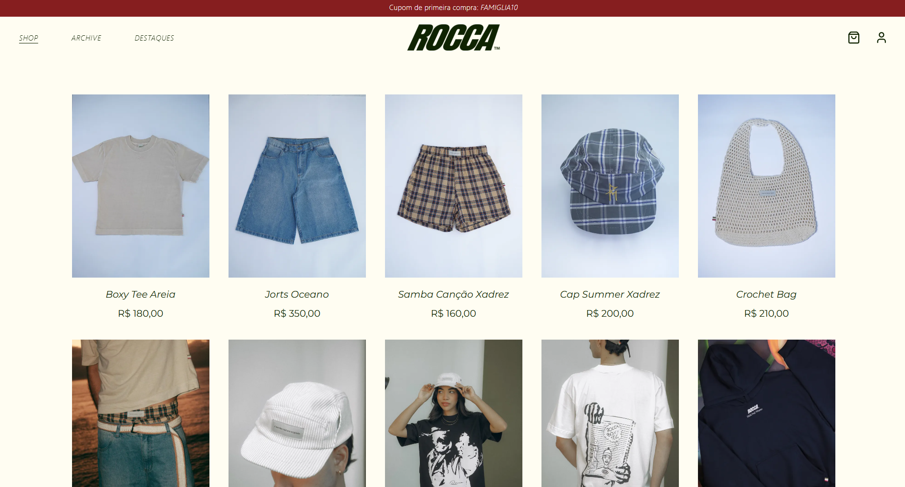
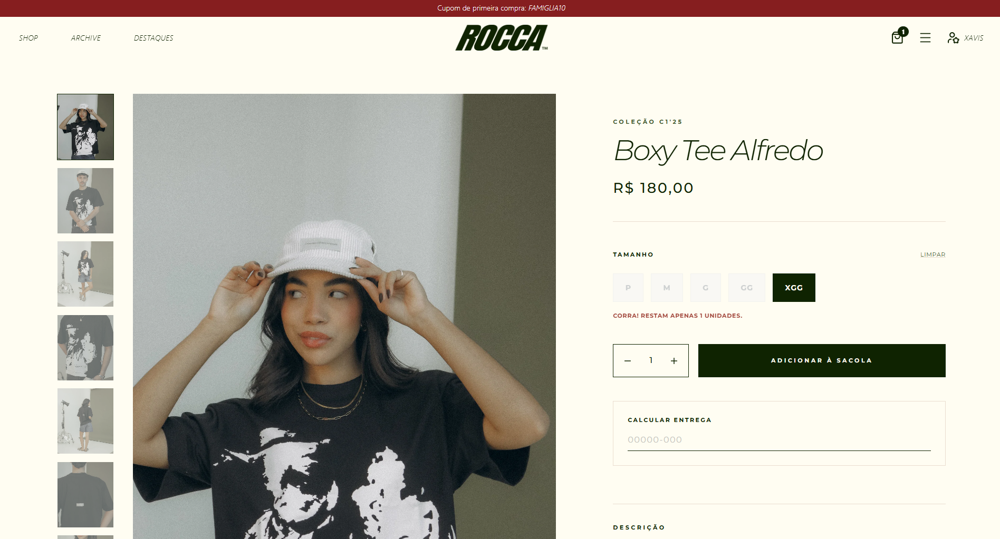
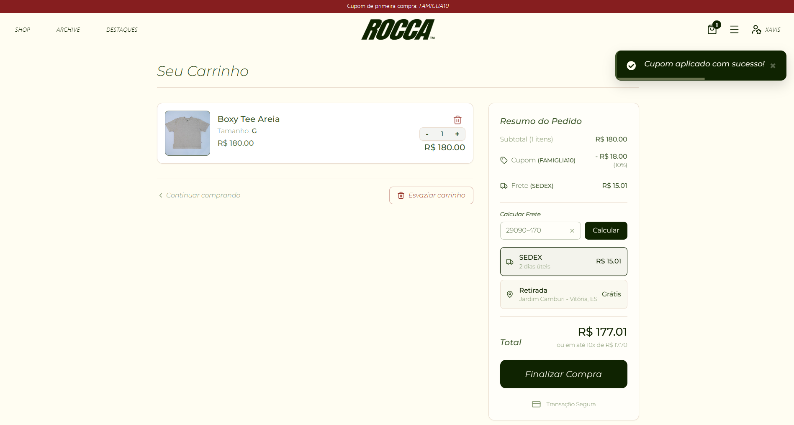
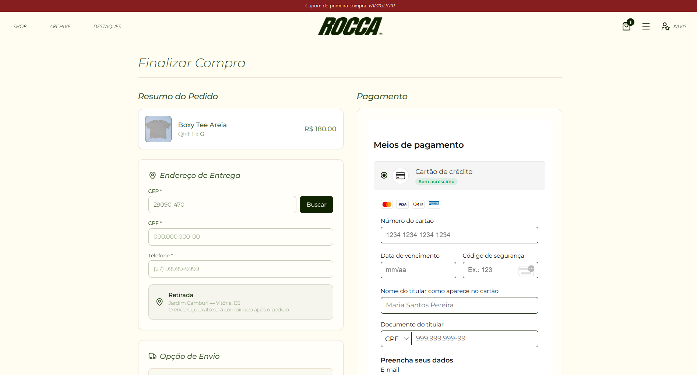
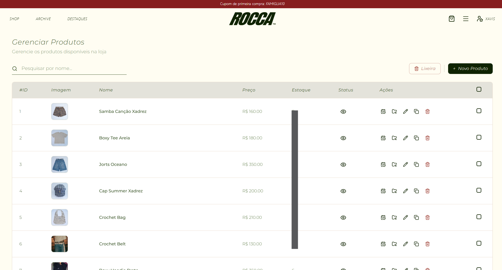
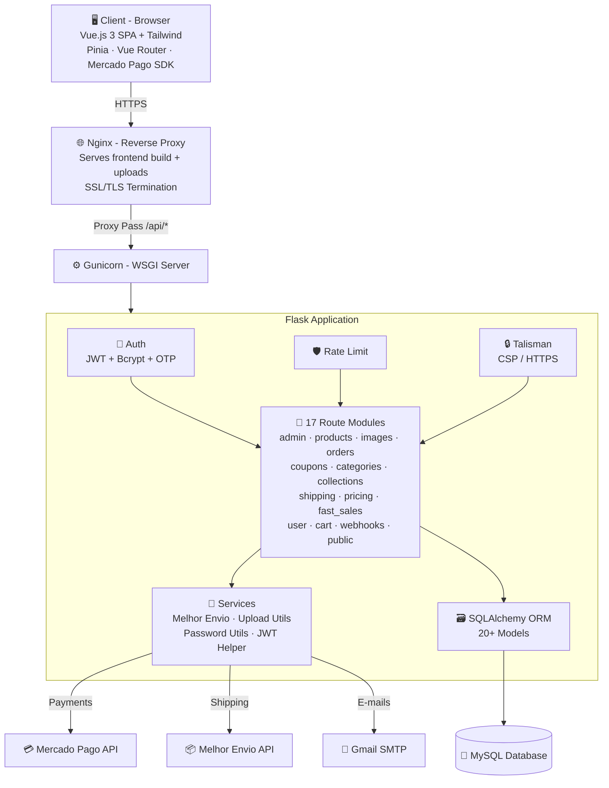

<p align="center">
  <h1 align="center">🛒 Fullstack E-Commerce Platform</h1>
  <p align="center">
    A complete fullstack e-commerce platform, built from scratch — from the public storefront to the admin panel.
    <br/>
    <strong>Vue.js · Flask · MySQL · Tailwind CSS · Mercado Pago · Melhor Envio · Nginx · VPS</strong>
  </p>
</p>

<p align="center">
  
  
  
  
  
  
  
  
</p>

---

> **⚠️ Showcase Repository** — This is a sanitized version of a system running in **real production**. Credentials, environment variables, and sensitive configurations have been removed for security reasons. The code is available **for viewing and analysis purposes only**.

---

## 📋 About the Project

A complete e-commerce platform built for a fashion brand, covering the entire journey — from the **public storefront** with catalog, cart, and checkout, to the **admin panel** with product management, orders, coupons, pricing, and quick sales.

A production-ready **fullstack** system with **payment** integration (Mercado Pago), **shipping calculation** (Melhor Envio / Correios), and **image optimization** (WebP + thumbnails + blur placeholders).

**🌐 Live project:** [roccainternazionale.com](https://roccainternazionale.com)

### 📸 Preview

Real data hidden for security reasons.

<table>
  <tr>
    <td align="center"><br/><sub>Shop / Storefront</sub></td>
    <td align="center"><br/><sub>Product Detail</sub></td>
    <td align="center"><br/><sub>Cart</sub></td>
  </tr>
  <tr>
    <td align="center"><br/><sub>Checkout</sub></td>
    <td align="center"><br/><sub>Product Catalog</sub></td>
    <td align="center"><br/><sub>Archive & Sidebar</sub></td>
  </tr>
</table>

---

## ✨ Features

### 🛍️ Public Storefront

#### 🏠 Storefront / Home
- Product catalog with a responsive grid
- Filters by **categories** and **collections**
- Sorting and pagination
- Optimized images with **lazy loading** + **blur placeholder** (base64)
- Product publish scheduling

#### 📦 Product Detail
- Image gallery with variant selection (sizes)
- Stock control per variant (S, M, L, XL, One Size)
- Dynamic pricing and real-time availability check

#### 🛒 Shopping Cart
- Backend persistence (linked to the logged-in user)
- Quantity control with stock validation
- Discount coupon application
- Preview dropdown in the navbar

#### 💳 Full Checkout
- Address form with automatic zip code lookup
- Shipping calculation integrated with **Melhor Envio** (PAC / SEDEX)
- Payment via **Mercado Pago** (Pix and Credit Card)
- Configurable installments
- Payment confirmation webhooks
- Success and awaiting-Pix-payment screens

#### 🔐 Customer Authentication
- Sign-up with **e-mail verification** (6-digit OTP)
- Login with **JWT** (JSON Web Tokens)
- E-mail and password change with OTP validation
- Password recovery via e-mail
- Customer area: profile and order history

### 🔧 Admin Panel

#### 📦 Product Management
- Full CRUD with size variants and per-variant stock
- Multiple image upload with **drag & drop** and reordering
- Automatic optimization: WebP conversion, thumbnail (600px), blur placeholder (20px)
- Publish scheduling
- Product trash (soft delete with restore)
- Custom product ordering in the store (sort_order)

#### 🏷️ Categories & Collections
- CRUD for categories and collections
- N:N association with products
- Featured ordering per category (highlight_order)

#### 🎟️ Coupon System
- Discount coupons: percentage or fixed value
- Free shipping as a coupon benefit
- Advanced rules: minimum/maximum spend, individual use, expiration date
- Filters by products, categories, and collections (inclusion and exclusion)
- Total and per-account usage limits
- Coupon activation/deactivation

#### 📋 Order Management
- Order listing with status filters
- Full details: items, address, shipping, payment
- Integration with **Melhor Envio** to add to the shipping cart

#### 💰 Quick Sales (In-Person)
- Recording of in-person sales (counter/event)
- Product and variant selection with stock control
- Payment methods: Pix, Cash, Card, Installments
- Full CRUD (create, edit, view, delete)

#### 💲 Pricing
- Per-product pricing calculator
- Cost, price, shipping subsidy, ads

#### 👥 User/Customer Management
- Customer listing with promotion to admin
- Permission control (customer vs. admin)

#### 📊 Policies and Legal Pages
- Privacy Policy and Return Policy rendered on the frontend

---

## 🛠️ Tech Stack

### Frontend
| Technology | Use |
|---|---|
| **Vue.js 3** | SPA framework with Composition API |
| **Vite 6** | Build tool and dev server |
| **Tailwind CSS 3** | Utility-first styling |
| **Pinia** | Global state management (cart, auth, UI) |
| **Vue Router 4** | SPA routing with authentication guards |
| **Axios** | HTTP client for REST API |
| **Mercado Pago SDK** | Payment integration (Pix + Card) |
| **Lucide Icons** | Icon library |
| **Vue Toastification** | Toast notifications |
| **Reka UI** | Headless UI components |
| **shadcn-vue** | Styled component system |
| **VueUse** | Composition utilities |

### Backend
| Technology | Use |
|---|---|
| **Python / Flask 3.1** | Web framework and REST API |
| **Flask-SQLAlchemy** | ORM for database modeling and queries |
| **Flask-JWT-Extended** | JWT token-based authentication |
| **Flask-Bcrypt** | Secure password hashing |
| **Flask-Limiter** | Rate limiting per IP |
| **Flask-Talisman** | Security headers and CSP (Content Security Policy) |
| **Flask-CORS** | Dynamic CORS control (dev/prod) |
| **Flask-Mail** | Transactional e-mail sending (OTP, confirmations) |
| **Pillow (PIL)** | Image processing: resize, WebP, thumbnails, placeholders |
| **PyMySQL** | MySQL connection driver |
| **APScheduler** | Task scheduling (scheduled product publishing) |
| **Requests** | Communication with external APIs (Melhor Envio, VPS) |

### External Integrations
| Service | Use |
|---|---|
| **Mercado Pago** | Payment gateway (Pix + Credit Card) |
| **Melhor Envio** | Shipping calculation (PAC / SEDEX) and label generation |
| **Gmail SMTP** | Transactional e-mail sending (verification, password) |

### Infrastructure
| Technology | Use |
|---|---|
| **Linux (Ubuntu VPS)** | Production server |
| **Nginx** | Reverse proxy, SSL/TLS, and static files |
| **Gunicorn** | WSGI HTTP Server for Flask |
| **MySQL** | Relational database |

---

## 🏗️ Architecture


```mermaid
flowchart TD
    CLIENT["🖥️ Client - Browser\nVue.js 3 SPA + Tailwind\nPinia · Vue Router · Mercado Pago SDK"]
    NGINX["🌐 Nginx - Reverse Proxy\nServes frontend build + uploads\nSSL/TLS Termination"]
    GUNICORN["⚙️ Gunicorn - WSGI Server"]
    
    subgraph FLASK["Flask Application"]
        direction TB
        AUTH["🔐 Auth\nJWT + Bcrypt + OTP"]
        RATE["🛡️ Rate Limit"]
        TALISMAN["🔒 Talisman\nCSP / HTTPS"]
        ROUTES["📡 17 Route Modules\nadmin · products · images · orders\ncoupons · categories · collections\nshipping · pricing · fast_sales\nuser · cart · webhooks · public"]
        SERVICES["🔌 Services\nMelhor Envio · Upload Utils\nPassword Utils · JWT Helper"]
        ORM["🗃️ SQLAlchemy ORM\n20+ Models"]
        
        AUTH & RATE & TALISMAN --> ROUTES
        ROUTES --> SERVICES
        ROUTES --> ORM
    end
    
    DB[("🐬 MySQL Database")]
    MP["💳 Mercado Pago API"]
    ME["📦 Melhor Envio API"]
    MAIL["📧 Gmail SMTP"]
    
    CLIENT -->|HTTPS| NGINX
    NGINX -->|"Proxy Pass /api/*"| GUNICORN
    GUNICORN --> FLASK
    ORM --> DB
    SERVICES -->|Payments| MP
    SERVICES -->|Shipping| ME
    SERVICES -->|E-mails| MAIL
```

---

## 📂 Project Structure

```
fullstack-ecommerce-platform-Showcase/
│
├── backend/
│   ├── rocca_app/
│   │   ├── __init__.py              # App factory (Flask, extensions, CORS, Talisman, Mail)
│   │   ├── models.py                # 20+ SQLAlchemy models
│   │   ├── routes/
│   │   │   ├── admin_product_routes.py    # Product CRUD (variants, images, scheduling)
│   │   │   ├── admin_images_routes.py     # Image upload, optimization, and management
│   │   │   ├── admin_order_routes.py      # Admin order management
│   │   │   ├── admin_coupon_routes.py     # Coupon CRUD with advanced rules
│   │   │   ├── admin_category_routes.py   # Category CRUD
│   │   │   ├── admin_collection_routes.py # Collection CRUD
│   │   │   ├── admin_shipping_routes.py   # Melhor Envio integration (shipping cart)
│   │   │   ├── admin_routes.py            # Admin user management
│   │   │   ├── admin_utils_routes.py      # Admin utilities
│   │   │   ├── fast_sale_routes.py        # Quick (in-person) sales
│   │   │   ├── pricing_routes.py          # Pricing calculator
│   │   │   ├── user_routes.py             # Auth, profile, e-mail OTP, customer orders
│   │   │   ├── user_product_routes.py     # Public product catalog
│   │   │   ├── user_cart_routes.py        # Cart + checkout + Mercado Pago
│   │   │   ├── shipping_routes.py         # Public shipping calculation
│   │   │   ├── public_coupon_routes.py    # Public coupon validation
│   │   │   └── webhook_routes.py          # Mercado Pago webhooks
│   │   ├── services/
│   │   │   └── melhor_envio_service.py    # Melhor Envio integration (shipping + OAuth2)
│   │   └── utils/
│   │       ├── upload_utils.py            # Image processing (WebP, thumbnail, blur)
│   │       ├── password_utils.py          # Password hashing and validation
│   │       └── jwt_helper.py             # JWT configuration
│   ├── scheduler.py                 # Product publish scheduler
│   ├── create_tables.py             # Table creation script
│   └── static/                      # Image uploads
│
├── frontend/
│   ├── index.html
│   ├── vite.config.js
│   ├── tailwind.config.js
│   ├── package.json
│   └── src/
│       ├── App.vue
│       ├── main.js                  # Vue app bootstrap
│       ├── api.js                   # Axios configuration
│       ├── index.css                # Global styles
│       ├── router/index.js          # Routes with authentication guards
│       ├── stores/
│       │   ├── cart.js              # Cart state (persisted on backend)
│       │   ├── user.js              # Authentication state
│       │   ├── ui.js                # UI state (modals, sidebar)
│       │   └── editMode.js          # Admin edit mode
│       ├── views/
│       │   ├── HomeView.vue         # Store homepage
│       │   ├── ProductsView.vue     # Product listing
│       │   ├── ProductDetailView.vue # Product detail
│       │   ├── ArchiveView.vue      # Archive/filters
│       │   ├── CartView.vue         # Shopping cart
│       │   ├── CheckoutView.vue     # Full checkout (address + shipping + payment)
│       │   ├── OrderSuccessView.vue # Order confirmation
│       │   ├── OrderPendingPixView.vue # Awaiting Pix payment
│       │   ├── PrivacyPolicyView.vue # Privacy Policy
│       │   ├── ReturnPolicyView.vue # Return Policy
│       │   ├── NotFoundView.vue     # 404 page
│       │   ├── admin/               # 10 admin views
│       │   │   ├── AdminProductsView.vue
│       │   │   ├── AdminOrdersView.vue
│       │   │   ├── AdminCouponsView.vue
│       │   │   ├── AdminCategoriesView.vue
│       │   │   ├── AdminCollectionsView.vue
│       │   │   ├── AdminPricingView.vue
│       │   │   ├── AdminFastSaleView.vue
│       │   │   ├── AdminShippingView.vue
│       │   │   ├── AdminUsersView.vue
│       │   │   └── AdminBinProductsView.vue
│       │   └── user/                # Customer area
│       │       ├── UserProfileView.vue
│       │       └── UserOrdersView.vue
│       └── components/
│           ├── NavBar.vue           # Navbar with cart dropdown
│           ├── Footer.vue           # Store footer
│           ├── AuthModal.vue        # Login/sign-up/OTP modal
│           ├── FuzzyImage.vue       # Lazy loading component with blur
│           ├── CartDropdown.vue     # Cart preview in navbar
│           ├── admin/               # 17+ admin components
│           ├── shop/                # Store components (ProductCard)
│           ├── cart/                # Cart modals
│           ├── user/                # Customer area components
│           └── common/              # Reusable components (Select, DatePicker, etc.)
│
├── config.py                        # Per-environment configuration (Dev/Prod)
├── run.py                           # Application entrypoint
├── wsgi.py                          # WSGI config for Gunicorn
└── requirements.txt                 # Python dependencies
```

---

## 🗄️ Data Model

The system has **20+ interrelated tables**:

| Model | Description |
|---|---|
| `User` | Customers and admins with authentication fields |
| `Product` | Products with price, shipping dimensions, scheduling, and ordering |
| `ProductVariant` | Size variants (S, M, L, XL, One Size) with individual stock |
| `ProductImage` | Images with public URL, thumbnail, and blur placeholder (base64) |
| `Category` | Product categories |
| `ProductCategory` | N:N product↔category association with highlight_order |
| `Collection` | Product collections |
| `ProductCollection` | N:N product↔collection association |
| `Cart` | Customer shopping cart (with applied coupon) |
| `CartItem` | Cart items with variant and quantity |
| `Order` | Full order: payment, shipping, address, status |
| `OrderItem` | Order items with variant and price |
| `Coupon` | Coupons with advanced rules (%, fixed, free shipping, limits) |
| `ProductCoupon` | Coupon↔product association (inclusion/exclusion) |
| `CategoryCoupon` | Coupon↔category association (inclusion/exclusion) |
| `CollectionCoupon` | Coupon↔collection association (inclusion/exclusion) |
| `FastSale` | In-person sales (counter/event) |
| `FastSaleItem` | Quick sale items |
| `PricingItem` | Pricing calculator |
| `AppSetting` | App settings (Melhor Envio OAuth2 tokens) |
| `EmailVerificationToken` | OTP tokens for e-mail verification |

---

## 🖼️ Image Pipeline

The system has a custom image optimization pipeline:

```
Upload (JPG/PNG/WebP)
  ↓
Pillow (Python)
  ├── Automatic EXIF rotation (mobile photos)
  ├── Conversion to RGB
  ├── Optimized original → max 2000px, WebP quality 85
  ├── Thumbnail → 600px, WebP quality 80
  └── Blur placeholder → 20px, base64 data URI (inline)
```

- **Original**: Used on the product detail page
- **Thumbnail**: Used in the store grid (faster loading)
- **Placeholder**: Shown while the image loads (blur → sharp effect)

---

## 🔒 Security

- **JWT Authentication** — Access tokens with expiration
- **Bcrypt** — Salted password hashing
- **E-mail OTP** — 6-digit e-mail verification (sign-up and e-mail change)
- **Flask-Talisman** — Security headers and Content Security Policy
- **Rate Limiting** — Brute-force protection per IP
- **Dynamic CORS** — Restricted origins in production, permissive in development
- **Route Guards** — Frontend route protection with Vue Router
- **Access Control** — `@admin_required` decorator for admin routes
- **Secure Webhooks** — Signature validation on Mercado Pago webhooks
- **Secure Upload** — Extension validation and server-side processing with Pillow
- **Upload Token** — Token-based authentication for remote uploads (VPS ↔ Dev)

---

## ⚠️ Important Notice

This repository is a code **showcase**. It **cannot be run** directly, because:

- Environment variables (`.env`) have been removed
- Database credentials are not present
- API keys (Mercado Pago, Melhor Envio) are not included
- Production server configurations are not included

The goal is to demonstrate the **code quality**, **architecture**, and **technical decisions** made while developing a real e-commerce platform in production.

---

## 👨‍💻 Author

**Lucas Xavier**

---

<p align="center">
  <sub>Built with dedication — from backend to deploy. 🚀</sub>
</p>
